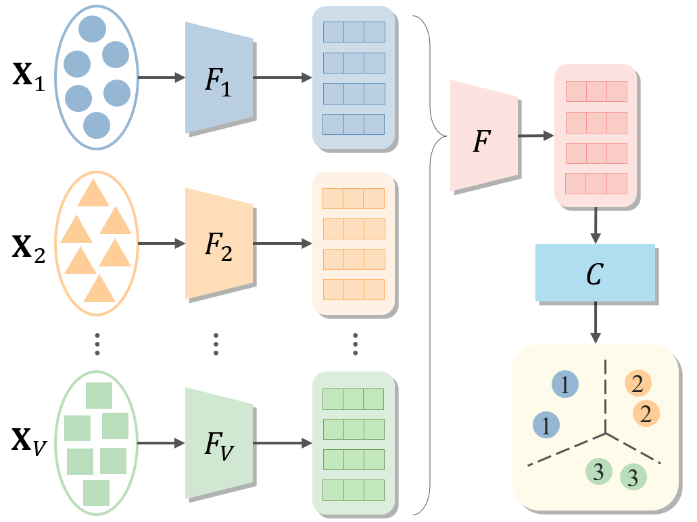

[stars-img]: https://img.shields.io/github/stars/jinjiaqi1998/Awesome-Deep-Multiview-Clustering?color=yellow
[stars-url]: https://github.com/jinjiaqi1998/Awesome-Deep-Multiview-Clustering/stargazers
[fork-img]: https://img.shields.io/github/forks/jinjiaqi1998/Awesome-Deep-Multiview-Clustering?color=lightblue&label=fork
[fork-url]: https://github.com/jinjiaqi1998/Awesome-Deep-Multiview-Clustering/network/members


# Awesome-Deep-Multiview-Clustering
Collections for state-of-the-art and novel deep neural network-based multi-view clustering approaches (papers & codes). According to the integrity of multi-view data, such methods can be further subdivided into Deep Multi-view Clustering(**DMVC**) and Deep Incomplete Multi-view Clustering(**DIMVC**).

We are looking forward for other participants to share their papers and codes. If interested or any question about the listed papers and codes, please contanct <jinjiaqi@nudt.edu.cn>. If you find this repository useful to your research or work, it is really appreciated to star this repository. :sparkles: If you use our code or the processed datasets in this repository for your research, please cite 1-2 papers in the citation part [here](#jump4). :heart:

[![GitHub stars][stars-img]][stars-url]
[![GitHub forks][fork-img]][fork-url]


##  Table of Contents
- [What's Deep Multi-view Clustering?](#jump1) 
- [Surveys](#jump2) 
- [Papers & Codes](#jump3)
    - [Deep Multi-view Clustering(DMVC)](#jump31)
    - [Deep Incomplete Multi-view Clustering(DIMVC)](#jump32)
- [Citation](#jump4)


--------------

## <span id="jump1">What's Deep Multi-view Clustering? </span>
Deep multi-view clustering aims to reveal the potential complementary information of multiple features or modalities through deep neural networks, and finally divide samples into different groups in unsupervised scenarios.

<div  align="center">    
    
</div>

##  <span id="jump2">Surveys </span>
| Year | Title                                                                 |    Venue    |    Paper    |
| ---- | --------------------------------------------------------------------- | :---------: | :---------: |
| 2023 | **A Comprehensive Survey on Multi-view Clustering** |    TKDE   | [](https://ieeexplore.ieee.org/abstract/document/10108535) |
| 2022 | **Representation Learning in Multi-view Clustering: A Literature Review** | DSE | [](https://link.springer.com/article/10.1007/s41019-022-00190-8) |
| 2022 | **Foundations and Recent Trends in Multimodal Machine Learning: Principles, Challenges, and Open Questions** | Arxiv | [](https://arxiv.org/pdf/2209.03430) |
| 2021 | **Survey on Deep Multi-modal Data Analytics: Collaboration, Rivalry, and Fusion** | TOMM | [](https://arxiv.org/pdf/2006.08159.pdf) |
| 2021 | **Deep Multi-view Learning Methods: A Review** | Neurocom | [](https://researchportal.port.ac.uk/files/26919776/Manuscript_R_pp.pdf) |
| 2018 | **A Survey of Multi-View Representation Learning** | TKDE | [](https://arxiv.org/pdf/1610.01206) |
| 2018 | **Multi-view Clustering: A Survey** | BDMA | [](https://ieeexplore.ieee.org/iel7/8254253/8336843/08336846.pdf) |
| 2018 | **Multimodal Machine Learning: A Survey and Taxonomy** | TPAMI | [](https://arxiv.org/pdf/1705.09406) |
| 2018 | **A Survey on Multi-View Clustering** | Arxiv | [](https://arxiv.org/pdf/1712.06246.pdf) |
| 2017 | **Multi-view Learning Overview：Recent Progress and New Challenges** | IF | [](https://shiliangsun.github.io/pubs/MVLoverviewIF17.pdf) |
| 2013 | **A Survey on Multi-view Learning** | Arxiv | [](https://arxiv.org/pdf/1304.5634) |

---

## <span id="jump3">Papers & Codes </span>
According to the integrity of multi-view data, the paper is divided into deep multi-view clustering methods and deep incomplete multi-view clustering approaches.

### <span id="jump31">Deep Multi-view Clustering(DMVC)</span> 

| Year | Title                                                        | Abbreviation |    Venue    |    Paper    |     Code    |
| ---- | ------------------------------------------------------------ | :----------: | :---------: | :---------: | :---------: |
| 2023 | **Self-Supervised Graph Attention Networks for Deep Weighted Multi-View Clustering** | **SGDMC** | AAAI | [](https://ojs.aaai.org/index.php/AAAI/article/view/25960/25732) | - |
| 2023 | **Auto-attention Mechanism for Multi-view Deep Embedding Clustering** | **MDEC** | PR | [](https://www.sciencedirect.com/science/article/abs/pii/S0031320323004624) | - |
| 2023 | **Dual Fusion-Propagation Graph Neural Network for Multi-view Clustering** | **DFP-GNN** | TMM | [](https://ieeexplore.ieee.org/abstract/document/10050836/) | - |
| 2023 | **Joint Shared-and-Specific Information for Deep Multi-View Clustering** | **JSSI** | TCSVT | [](https://ieeexplore.ieee.org/abstract/document/10130402) | - |
| 2023 | **On the Effects of Self-supervision and Contrastive Alignment in Deep Multi-view Clustering** | **DeepMVC** | CVPR | [](http://openaccess.thecvf.com/content/CVPR2023/papers/Trosten_On_the_Effects_of_Self-Supervision_and_Contrastive_Alignment_in_Deep_CVPR_2023_paper.pdf) | [](https://github.com/DanielTrosten/DeepMVC) |
| 2023 | **GCFAgg：Global and Cross-view Feature Aggregation for Multi-view Clustering** | **GCFAgg** | CVPR | [](https://openaccess.thecvf.com/content/CVPR2023/papers/Yan_GCFAgg_Global_and_Cross-View_Feature_Aggregation_for_Multi-View_Clustering_CVPR_2023_paper.pdf) |  -  |
| 2023 | **Self-Supervised Information Bottleneck for Deep Multi-View Subspace Clustering** | **SIB-MSC** | TIP   | [](https://arxiv.org/pdf/2204.12496.pdf) |  -  |
| 2023 | **Multi-channel Augmented Graph Embedding Convolutional Network for Multi-view Clustering** |    **MAGEC-Net**    | TNSE |  [](https://ieeexplore.ieee.org/abstract/document/10043740/) | - |
| 2022 | **Deep Safe Multi-View Clustering：Reducing the Risk of Clustering Performance Degradation Caused by View Increase** | **DSMVC** | CVPR |  [](https://openaccess.thecvf.com/content/CVPR2022/papers/Tang_Deep_Safe_Multi-View_Clustering_Reducing_the_Risk_of_Clustering_Performance_CVPR_2022_paper.pdf) | [](https://github.com/Gasteinh/DSMVC) |
| 2022 | **Multi-level Feature Learning for Contrastive Multi-view Clustering** | **MFLVC** | CVPR |  [](https://openaccess.thecvf.com/content/CVPR2022/papers/Xu_Multi-Level_Feature_Learning_for_Contrastive_Multi-View_Clustering_CVPR_2022_paper.pdf) | [](https://github.com/SubmissionsIn/MFLVC) |
| 2022 | **Stationary Diffusion State Neural Estimation for Multiview Clustering** | **SDSNE** | AAAI |  [](https://www.aaai.org/AAAI22Papers/AAAI-184.LiuC.pdf) | [](https://github.com/kunzhan/SDSNE) |
| 2022 | **Multi-View Subspace Clustering via Structured Multi-Pathway Network** | **SMpNet** | TNNLS |  [](http://cic.tju.edu.cn/faculty/huqinghua/pdf/GeneralizedLatentMulti-ViewSubspaceClustering.pdf) | [](http://cic.tju.edu.cn/faculty/zhangchangqing/code.html) |
| 2022 | **Multiview Subspace Clustering With Multilevel Representations and Adversarial Regularization** | **MvSC-MRAR** | TNNLS |  [](https://www.researchgate.net/profile/Guowang-Du/publication/360244524_Multiview_Subspace_Clustering_With_Multilevel_Representations_and_Adversarial_Regularization/links/6291812e8d19206823e10ac7/Multiview-Subspace-Clustering-With-Multilevel-Representations-and-Adversarial-Regularization.pdf) | - |
| 2022 | **Self-Supervised Deep Multiview Spectral Clustering** | **SDMvSC** | TNNLS |  [](https://ieeexplore.ieee.org/abstract/document/9853217/) | - |
| 2022 | **Contrastive Multi-view Hyperbolic Hierarchical Clustering** | **CMHHC** | IJCAI |  [](https://arxiv.org/pdf/2205.02618.pdf) | - |
| 2022 | **Multi-view Graph Embedding Clustering Network：Joint Self-supervision and Block Diagonal Representation** | **MVGC** | NN |  [](https://www.sciencedirect.com/science/article/pii/S089360802100397X) | [](https://github.com/xdweixia/NN-2022-MVGC) |
| 2022 | **Efficient Multi‑view Clustering Networks** | **EMC-Nets** | APPL INTELL |  [](https://link.springer.com/article/10.1007/s10489-021-03129-0) | [](https://github.com/Guanzhou-Ke/EMC-Nets) |
| 2021 | **Deep Mutual Information Maximin for Cross-Modal Clustering** | **DMIM** | AAAI |  [](https://ojs.aaai.org/index.php/AAAI/article/view/17076/16883) | - |
| 2021 | **Uncertainty-Aware Multi-View Representation Learning** | **DUA-Nets** | AAAI |  [](https://ojs.aaai.org/index.php/AAAI/article/view/16924/16731) | [](http://cic.tju.edu.cn/faculty/zhangchangqing/code/daunet.zip) |
| 2021 | **Reconsidering Representation Alignment for Multi-view Clustering** | **SiMVC&CoMVC** | CVPR |  [](https://openaccess.thecvf.com/content/CVPR2021/papers/Trosten_Reconsidering_Representation_Alignment_for_Multi-View_Clustering_CVPR_2021_paper.pdf) | [](https://github.com/AllenWrong/mvc) |
| 2021 | **Deep Multiple Auto-Encoder-Based Multi-view Clustering** | **MVC_MAE** | DSE |  [](https://link.springer.com/article/10.1007/s41019-021-00159-z) | [](https://github.com/dugzzuli/Deep-Multiple-Auto-Encoder-Based-Multi-view-Clustering) |
| 2021 | **Multimodal Clustering Networks for Self-supervised Learning from Unlabeled Videos** | **MCN** | ICCV |  [](https://openaccess.thecvf.com/content/ICCV2021/papers/Chen_Multimodal_Clustering_Networks_for_Self-Supervised_Learning_From_Unlabeled_Videos_ICCV_2021_paper.pdf) | [](https://github.com/brian7685/Multimodal-Clustering-Network) |
| 2021 | **Multi-VAE: Learning Disentangled View-common and View-peculiar Visual Representations for Multi-view Clustering** | **Multi-VAE** | ICCV |  [](https://openaccess.thecvf.com/content/ICCV2021/papers/Xu_Multi-VAE_Learning_Disentangled_View-Common_and_View-Peculiar_Visual_Representations_for_Multi-View_ICCV_2021_paper.pdf) | [](https://github.com/SubmissionsIn/Multi-VAE) |
| 2021 | **Graph Filter-based Multi-view Attributed Graph Clustering** | **MvAGC** | IJCAI |  [](https://www.ijcai.org/proceedings/2021/0375.pdf) | [](https://github.com/sckangz/MvAGC) |
| 2021 | **Multi-view Subspace Clustering Networks with Local and Global Graph Information** | **MSCNGL** | Neurocom |  [](https://arxiv.53yu.com/pdf/2010.09323) | [](https://github.com/qinghai-zheng/MSCNLG) |
| 2021 | **Attentive Multi-View Deep Subspace Clustering Net** | **AMVDSN** | Neurocom |  [](https://arxiv.org/pdf/2112.12506.pdf) | - |
| 2021 | **Multi-view Contrastive Graph Clustering** | **MCGC** | NeurIPS |  [](https://proceedings.neurips.cc/paper/2021/file/10c66082c124f8afe3df4886f5e516e0-Paper.pdf) | [](https://github.com/panern/mcgc) |
| 2021 | **Self-supervised Discriminative Feature Learning for Deep Multi-view Clustering** | **SDMVC** | TKDE |  [](https://arxiv.org/pdf/2103.15069.pdf) | [](https://github.com/SubmissionsIn/SDMVC) |
| 2021 | **Multi-view Attributed Graph Clustering** | **MAGC** | TKDE |  [](https://www.researchgate.net/publication/353747180_Multi-view_Attributed_Graph_Clustering) | [](https://github.com/sckangz/MAGC) |
| 2021 | **Deep Multi-view Subspace Clustering with Unified and Discriminative Learning** | **DMSC-UDL** | TMM |  [](https://ieeexplore.ieee.org/abstract/document/9204408/) | [](https://github.com/IMKBLE/DMSC-UDL) |
| 2021 | **Self-supervised Graph Convolutional Network for Multi-view Clustering** | **SGCMC** | TMM |  [](https://ieeexplore.ieee.org/abstract/document/9472979/) | [](https://github.com/xdweixia/SGCMC) |
| 2021 | **Consistent Multiple Graph Embedding for Multi-View Clustering** | **CMGEC** | TMM |  [](https://arxiv.org/pdf/2105.04880) | [](https://github.com/wangemm/CMGEC-TMM-2021) |
| 2021 | **Deep Multiview Collaborative Clustering** | **DMCC** | TNNLS |  [](https://see.xidian.edu.cn/faculty/chdeng/Welcome%20to%20Cheng%20Deng's%20Homepage_files/Papers/Journal/TNNLS2021_Xu.pdf) | - |
| 2020 | **Partially View-aligned Clustering** | **PVC** | NeurIPS |  [](https://proceedings.neurips.cc/paper/2020/file/1e591403ff232de0f0f139ac51d99295-Paper.pdf) | [](https://github.com/hi-zhenyu/PVC) |
| 2020 | **Cross-modal Subspace Clustering via Deep Canonical Correlation Analysis** | **CMSC-DCCA** | AAAI |  [](https://ojs.aaai.org/index.php/AAAI/article/view/5808/5664) | - |
| 2020 | **Shared Generative Latent Representation Learning for Multi-View Clustering** | **DMVCVAE** | AAAI |  [](https://ojs.aaai.org/index.php/AAAI/article/download/6146/6002) | [](https://github.com/whytin95/DMVCVAE) |
| 2020 | **End-to-End Adversarial-Attention Network for Multi-Modal Clustering** | **EAMC** | CVPR |  [](https://openaccess.thecvf.com/content_CVPR_2020/papers/Zhou_End-to-End_Adversarial-Attention_Network_for_Multi-Modal_Clustering_CVPR_2020_paper.pdf) | [](https://github.com/AllenWrong/mvc) |
| 2020 | **Multi-View Attribute Graph Convolution Networks for Clustering** | **MAGCN** | IJCAI |  [](https://www.ijcai.org/proceedings/2020/0411.pdf) | [](https://github.com/IMKBLE/MAGCN) |
| 2020 | **End-To-End Deep Multimodal Clustering** | **DMMC** | ICME |  [](https://ieeexplore.ieee.org/abstract/document/9102921/) | [](https://github.com/Guanzhou-Ke/DMMC-zoo) |
| 2020 | **Deep Embedded Multi-view Clustering with Collaborative Training** | **DEMVC** | IS |  [](https://arxiv.org/pdf/2007.13067.pdf) | [](https://github.com/SubmissionsIn/DEMVC) |
| 2020 | **Joint Deep Multi-View Learning for Image Clustering** | **DMJC** | TKDE |  [](https://ieeexplore.ieee.org/abstract/document/8999493/) | - |
| 2020 | **One2Multi Graph Autoencoder for Multi-view Graph Clustering** | **O2MVC** | WWW |  [](http://shichuan.org/doc/83.pdf) | [](https://github.com/googlebaba/WWW2020-O2MAC) |
| 2019 | **AE^2-Nets: Autoencoder in Autoencoder Networks** | **AE^2-Nets** | CVPR |  [](http://cic.tju.edu.cn/faculty/zhangchangqing/pub/AE2_Nets.pdf) | [](https://github.com/willow617/AE2-Nets) |
| 2019 | **COMIC: Multi-view Clustering Without Parameter Selection** | **COMIC** | ICML |  [](http://proceedings.mlr.press/v97/peng19a/peng19a.pdf) | [](https://github.com/limit-scu/2019-ICML-COMIC) |
| 2019 | **Deep Adversarial Multi-view Clustering Network** | **DAMC** | IJCAI |  [](https://www.researchgate.net/publication/334844473_Deep_Adversarial_Multi-view_Clustering_Network) | [](https://github.com/IMKBLE/DAMC) |
| 2019 | **Multi-view Spectral Clustering Network** | **MvSCN** | IJCAI |  [](https://www.ijcai.org/Proceedings/2019/0356.pdf) | [](https://github.com/limit-scu/2019-IJCAI-MvSCN) |
| 2019 | **Multi-view Deep Subspace Clustering Networks** | **MvDSCN** | TIP |  [](https://arxiv.org/abs/1908.01978) | [](https://github.com/huybery/MvDSCN) |
| 2018 | **Generalized Latent Multi-View Subspace Clustering** | **gLMSC** | TPAMI |  [](http://cic.tju.edu.cn/faculty/huqinghua/pdf/GeneralizedLatentMulti-ViewSubspaceClustering.pdf) | [](http://cic.tju.edu.cn/faculty/zhangchangqing/code.html) |
| 2018 | **Deep Multimodal Subspace Clustering Networks** | **DMSC** | STSP |  [](https://arxiv.org/pdf/1804.06498.pdf) | [](https://github.com/mahdiabavisani/Deep-multimodal-subspace-clustering-networks) |
| 2018 | **Deep Multi-View Clustering via Multiple Embedding** | **DMVC-ME** | CoRR |  [](https://deepai.org/publication/deep-multi-view-clustering-via-multiple-embedding) | - |


---

### <span id="jump32">Deep Incomplete Multi-view Clustering(DIMVC)</span> 

| Year | Title                                                        | Abbreviation |    Venue    |    Paper    |     Code    |
| ---- | ------------------------------------------------------------ | :----------: | :---------: | :---------: | :---------: |
| 2023 | **Deep Incomplete Multi-view Clustering with Cross-view Partial Sample and Prototype Alignment** | **CPSPAN** | CVPR |  [](http://openaccess.thecvf.com/content/CVPR2023/papers/Jin_Deep_Incomplete_Multi-View_Clustering_With_Cross-View_Partial_Sample_and_Prototype_CVPR_2023_paper.pdf) | [](https://github.com/jinjiaqi1998/CPSPAN) |
| 2023 | **Adaptive Feature Projection with Distribution Alignment for Deep Incomplete Multi-view Clustering** | **APADC** | TIP |  [](https://ieeexplore.ieee.org/abstract/document/10043822/) | [](https://github.com/SubmissionsIn/APADC) |
| 2023 | **Incomplete Multi-view Clustering via Prototype-based Imputation** | **ProImp** | IJCAI |  [](https://arxiv.org/pdf/2301.11045) | [](https://github.com/XLearning-SCU/2023-IJCAI-ProImp) |
| 2023 | **Consistent Graph Embedding Network with Optimal Transport for Incomplete Multi-view Clustering** | **CGEN-OT** | IS |  [](https://www.sciencedirect.com/science/article/pii/S0020025523010034) | - |
| 2023 | **Incomplete Multi-view Clustering Network via Nonlinear Manifold Embedding and Probability-Induced Loss** | **IMCNet-MP** | NN |  [](https://www.sciencedirect.com/science/article/pii/S0893608023001302) | - |
| 2022 | **Robust Multi-view Clustering with Incomplete Information** | **SURE** | TPAMI |  [](https://ieeexplore.ieee.org/abstract/document/9723577/) | [](https://github.com/XLearning-SCU/2022-TPAMI-SURE) |
| 2022 | **Dual Contrastive Prediction for Incomplete Multi-view Representation Learning** | **DCP** | TPAMI |  [](http://pengxi.me/wp-content/uploads/2022/08/DCP.pdf) | [](https://github.com/XLearning-SCU/2021-CVPR-Completer) |
| 2022 | **Deep Safe Incomplete Multi-view Clustering: Theorem and Algorithm** | **DSIMVC** | ICML |  [](https://proceedings.mlr.press/v162/tang22c/tang22c.pdf) | [](https://github.com/Gasteinh/DSIMVC) |
| 2022 | **Deep Incomplete Multi-view Clustering via Mining Cluster Complementarity** | **DIMVC** | AAAI |  [](https://ojs.aaai.org/index.php/AAAI/article/download/20856/20615) | [](https://github.com/SubmissionsIn/DIMVC) |
| 2022 | **Robust Diversified Graph Contrastive Network for Incomplete Multi-view Clustering** | **RDGC** | ACM MM |  [](https://dl.acm.org/doi/abs/10.1145/3503161.3547894) | [](https://github.com/zh-hike/RDGC) |
| 2022 | **Incomplete Multi-view Clustering via Cross-view Relation Transfer** | **CRTC** | TCSVT |  [](https://arxiv.org/pdf/2112.00739) | - |
| 2022 | **Graph Contrastive Partial Multi-view Clustering** | **AGCL** | TMM |  [](https://ieeexplore.ieee.org/abstract/document/9904927/) | [](https://github.com/wangemm/AGCL-TMM-2022) |
| 2021 | **COMPLETER: Incomplete Multi-view Clustering via Contrastive Prediction** | **COMPLETER** | CVPR |  [](http://pengxi.me/wp-content/uploads/2021/03/2021CVPR-completer.pdf) | [](https://github.com/XLearning-SCU/2021-CVPR-Completer) |
| 2021 | **iCmSC: Incomplete Cross-modal Subspace Clustering** | **iCmSC** | TIP |  [](https://ieeexplore.ieee.org/abstract/document/9259207) | [](https://github.com/IMKBLE/iCmSC) |
| 2021 | **Generative Partial Multi-View Clustering With Adaptive Fusion and Cycle Consistency** | **GP-MVC** | TIP |  [](https://ieeexplore.ieee.org/abstract/document/9318542/) | [](https://github.com/IMKBLE/GP-MVC) |
| 2021 | **Clustering-Induced Adaptive Structure Enhancing Network for Incomplete Multi-View Data** | **CASEN** | IJCAI |  [](https://www.ijcai.org/proceedings/2021/0445.pdf) | - |
| 2021 | **Structural Deep Incomplete Multi-view Clustering Network** | **SDIMC-net** | CIKM |  [](https://dl.acm.org/doi/abs/10.1145/3459637.3482192) | - |
| 2021 | **Dual Alignment Self-Supervised Incomplete Multi-View Subspace Clustering Network** | **DASIMSC** | SPL |  [](https://ieeexplore.ieee.org/abstract/document/9573269/) | - |
| 2020 | **Deep Partial Multi-View Learning** | **DPML** | TPAMI |  [](https://ieeexplore.ieee.org/document/9258396) | [](http://cic.tju.edu.cn/faculty/zhangchangqing/code/DPML.zip) |
| 2020 | **CDIMC-net：Cognitive Deep Incomplete Multi-view Clustering Network(** | **CDIMC-net** | IJCAI |  [](https://www.ijcai.org/proceedings/2020/447) | [](https://github.com/DarrenZZhang/CDIMC-Net) |
| 2020 | **DIMC-net：Deep Incomplete Multi-view Clustering Network** | **DIMC-net** | ACM MM |  [](https://dl.acm.org/doi/10.1145/3394171.3413807) | - |
| 2020 | **Deep Incomplete Multi-View Multiple Clusterings** | **DiMVMC** | ICDM |  [](https://arxiv.org/pdf/2010.02024) | [](http://www.sdu-idea.cn/codes.php?name=DiMVMC) |
| 2019 | **CPM-Nets: Cross Partial Multi-View Networks** | **CPM-Nets** | NeurIPS |  [](https://papers.nips.cc/paper/2019/file/11b9842e0a271ff252c1903e7132cd68-Paper.pdf) | [](https://github.com/hanmenghan/CPM_Nets) |
| 2019 | **Adversarial Incomplete Multi-view Clustering** | **AIMC** | IJCAI |  [](https://www.ijcai.org/proceedings/2019/0546.pdf) | - |
| 2018 | **Partial Multi-View Clustering via Consistent GAN** | **PVC-GAN** | ICDM |  [](https://drive.google.com/file/d/1RrVeq_FHkLSgltNd1bVfyaHhtIclV5ZG/view) | [](https://github.com/IMKBLE/PVC-GAN) |

---

## <span id="jump4">Citation </span>
```
@inproceedings{jin2023deep,
  title={Deep Incomplete Multi-view Clustering with Cross-view Partial Sample and Prototype Alignment},
  author={Jin, Jiaqi and Wang, Siwei and Dong, Zhibin and Liu, Xinwang and Zhu, En},
  booktitle={Proceedings of the IEEE/CVF Conference on Computer Vision and Pattern Recognition},
  pages={11600--11609},
  year={2023}
}
```
